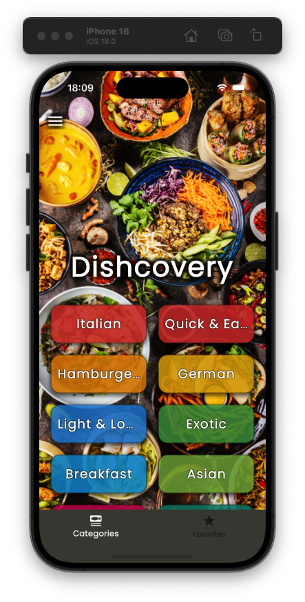

    
    
    
    
    

# Meal Recipes Application

This application is designed to help users discover and manage meal recipes. It leverages the Flutter framework to provide a seamless and responsive user experience across both iOS and Android platforms.

## Techniques and Packages Used

- **State Management**: The application uses the `provider` package for efficient state management.
- **Networking**: The `http` package is utilized to fetch data from external APIs.
- **Local Storage**: The `shared_preferences` package is used to store user preferences and favorite recipes locally.
- **Navigation**: The `flutter_navigation` package is implemented for smooth and intuitive navigation between different screens.
- **UI Components**: Custom widgets and the `flutter_svg` package are used to create a visually appealing interface.

## Functionalities Implemented

- **Recipe Search**: Users can search for recipes by ingredients or recipe names.
- **Recipe Details**: Detailed information about each recipe, including ingredients, steps, and nutritional information.
- **Favorites**: Users can save their favorite recipes for quick access.
- **Categories**: Recipes are categorized for easy browsing.
- **User Preferences**: Users can set dietary preferences and restrictions to filter recipes accordingly.

This application aims to make meal planning and cooking easier and more enjoyable for users by providing a comprehensive and user-friendly platform.